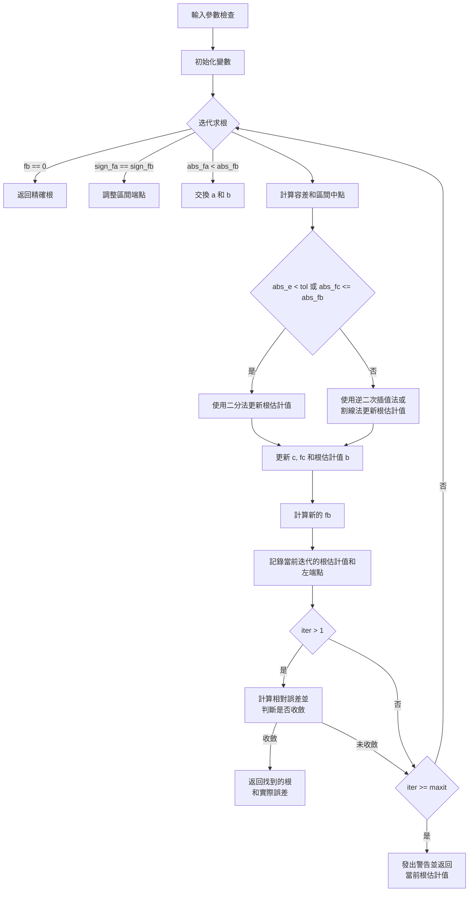

# Numerical Analysis Homework 4

網頁版: https://hackmd.io/@Xaio/HymeuGHkC

常見的包圍法求根有以下幾種:

1.  二分法(Bisection Method): 將可能包含根的區間一分為二，判斷根在哪一半區間內，然後繼續二分過程,直到區間夠小。優點是簡單易懂,一定可以找到根,缺點是**收斂較慢**。
2.  假位法(False Position Method): 類似二分法，但每次是用割線來逼近根,收斂速度比二分法快。缺點是有時會出現**收斂到另一個根的狀況**。
3.  雙線性插值法(Linear Interpolation): 利用線性內插來估計兩端點間的根的位置，逼近效果通常比二分法好,但**收斂的不夠快**。
4.  割線法(Secant Method): 利用兩個初始點的割線來逼近根，**收斂很快,但有時也會發散**。
5.  逆二次插值法(Inverse Quadratic Interpolation): 利用三個點的二次多項式內插來逼近根，在**接近根時收斂很快，但在離根較遠時，可能會導致發散**。
6.  Brent法(Brent's Method): 綜合了二分法、假位法和逆二次插值法，**快速迭代出解**又可避免割線法及逆二次插值法的發散問題。

以上方法都需要先找出一個包含根的區間，然後逐步縮小區間直到根被逼近。相較之下,開放法求根如牛頓法就不需要預先找出包含根的區間。

## $f(x) = x^{10}-1$


使用內建函數 `Solve` 找的根: -1.000000, 1.000000, -0.809017, 0.809017, -0.809017, 0.809017, -0.309017, -0.309017

使用 Matlab 試著找出上下界 x 為 [0， 1.3] 之間找根，最大迭代次數為100，終止條件 es = 0.0001%。

### False position method 

```text
The root found by False position method: 0.999997
func(root): -0.000025
iteration: 56
True percent relative error: 0.000078%
```


### Bisection method

```text
The root found by Bisection method: 0.999999
func(root): -0.000005
iteration: 20
True percent relative error: 0.000062%
```


### Linear Interpolation method

```text
The root found by Linear Interpolation method: 0.999997
func(root): -0.000025
iteration: 56
True percent relative error: 0.000078%
```


### Secant method 

==發散==

```text
The root found by Secant method: 0.181759
func(root): -1.000000
iteration: 4
True percent relative error: 0.000000%
```


### Inverse Quadratic Interpolation

==發散==

```text
The root found by Inverse Quadratic Interpolation: NaN
func(root): NaN
iteration: 49
True percent relative error: NaN%
```


### Brent-Dekker method


```text
The root found by Brent-Dekker method: 1.000032
func(root): 0.000325
iteration: 6
True percent relative error: 0.000000%
```


## Summary 

| Method                          | Iteration | Root     |    Es     |
| ------------------------------- | --------- | :------- | :-------: |
| False position method           | 56        | 0.999997 | 0.000078% |
| Bisection method                | 20        | 0.999999 | 0.000062% |
| Linear Interpolation method     | 56        | 0.999997 | 0.000078% |
| Secant Method                   | Divergent | X        |     X     |
| Inverse Quadratic Interpolation | Divergent | X        |     X     |
| ==Brent-Dekker method==         | 6         | 1.000032 | 0.000000% |

藉由 Matlab 模擬出與理論相當的結果。使用多種包圍法的 Brent method 可以兼顧準確度與迭代次數。


## Brent-Dekker Method Code Review 


1.  函數定義與輸入參數:
    -   函數名: brent
    -   輸入參數:
        -   func: 要求根的函數名
        -   l, u: 根所在區間的下界和上界
        -   es: 所需的相對誤差 (預設值為 0.0001%)
        -   maxit: 最大允許迭代次數 (預設值為 50)
    -   輸出參數:
        -   root: 找到的根
        -   ea: 實際達到的相對誤差
2.  參數檢查與預設值設定:
    -   檢查輸入參數的數量是否足夠 (至少需要 3 個)
    -   如果未提供 es 或 maxit,則使用預設值
3.  初始化變數:
    -   a, b: 根所在區間的端點
    -   fa, fb: 根所在區間端點處的函數值
    -   c, fc: 用於保存上一次迭代的 b 和 fb
    -   d, e: 用於控制根估計值的更新 step size
    -   iter: iteration 
    -   ea, l\_list, r\_list: 用於記錄每次迭代的相對誤差、左端點和右端點
4.  迭代求根:
    -   迭代直到滿足收斂條件或達到最大迭代次數
    -   在每次迭代中:
        -   如果 fb 為 0,則找到了精確根,直接返回
        -   如果 fa 和 fb 同號,則調整區間端點,使得根始終被括在區間內
        -   如果 |fa| < |fb|,則交換 a 和 b,確保 |fb| 始終較小
        -   計算容差 tol 和區間中點 m
        -   根據 e 和 fc 的大小決定是使用二分法還是使用逆二次插值法或割線法更新根估計值
            -   如果 |e| < tol 或 |fc| <= |fb|,則使用二分法
            -   否則,使用逆二次插值法或割線法,並根據插值結果調整更新步長
        -   更新 c, fc 為當前的 b, fb
        -   根據更新步長 d 的大小,更新根估計值 b
        -   計算新的 fb
        -   記錄當前迭代的根估計值和左端點
        -   如果迭代次數大於 1,則計算相對誤差,並判斷是否滿足收斂條件
        -   如果達到最大迭代次數,則發出警告並返回當前的根估計值
5.  返回結果:
    -   root: 找到的根
    -   ea: 實際達到的相對誤差
    -   r\_list, l\_list: 每次迭代的根估計值和左端點列表

1.  函數定義與輸入參數:
    -   函數名: brent
    -   輸入參數:
        -   func: 要求根的函數名
        -   l, u: 根所在區間的下界和上界
        -   es: 所需的相對誤差 (預設值為 1.0001%)
        -   maxit: 最大允許迭代次數 (預設值為 50)
    -   輸出參數:
        -   root: 找到的根
        -   ea: 實際達到的相對誤差
2.  參數檢查與預設值設定:
    -   檢查輸入參數的數量是否足夠 (至少需要 3 個)
    -   如果未提供 es 或 maxit,則使用預設值
3.  初始化變數:
    -   a, b: 根所在區間的端點
    -   fa, fb: 根所在區間端點處的函數值
    -   c, fc: 用於保存上一次迭代的 b 和 fb
    -   d, e: 用於控制根估計值的更新步長
    -   iter: Iteration
    -   ea, l\_list, r\_list: 用於記錄每次迭代的相對誤差、左端點和右端點
4.  迭代求根:
    -   迭代直到滿足收斂條件或達到最大迭代次數
    -   在每次迭代中:
        -   如果 fb 為 0,則找到了精確根,直接返回
        -   如果 fa 和 fb 同號,則調整區間端點,使得根始終被括在區間內
        -   如果 |fa| < |fb|,則交換 a 和 b,確保 |fb| 始終較小
        -   計算容差 tol 和區間中點 m
        -   根據 e 和 fc 的大小，決定是使用**二分法**還是使用**逆二次插值法**或**割線法**更新根估計值
            -   如果 |e| < tol 或 |fc| <= |fb|,則使用二分法
            -   否則,使用逆二次插值法或割線法,並根據插值結果調整更新步長
        -   更新 c, fc 為當前的 b, fb
        -   根據更新步長 d 的大小,更新根估計值 b
        -   計算新的 fb
        -   記錄當前迭代的根估計值和左端點
        -   如果迭代次數大於 1,則計算相對誤差,並判斷是否滿足收斂條件
        -   如果達到最大迭代次數,則發出警告並返回當前的根估計值
5.  返回結果:
    -   root: 找到的根
    -   ea: 實際達到的相對誤差
    -   r\_list, l\_list: 每次迭代的根估計值和左端點列表


### 流程圖
